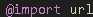
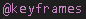
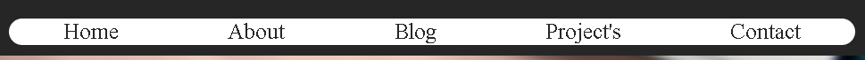
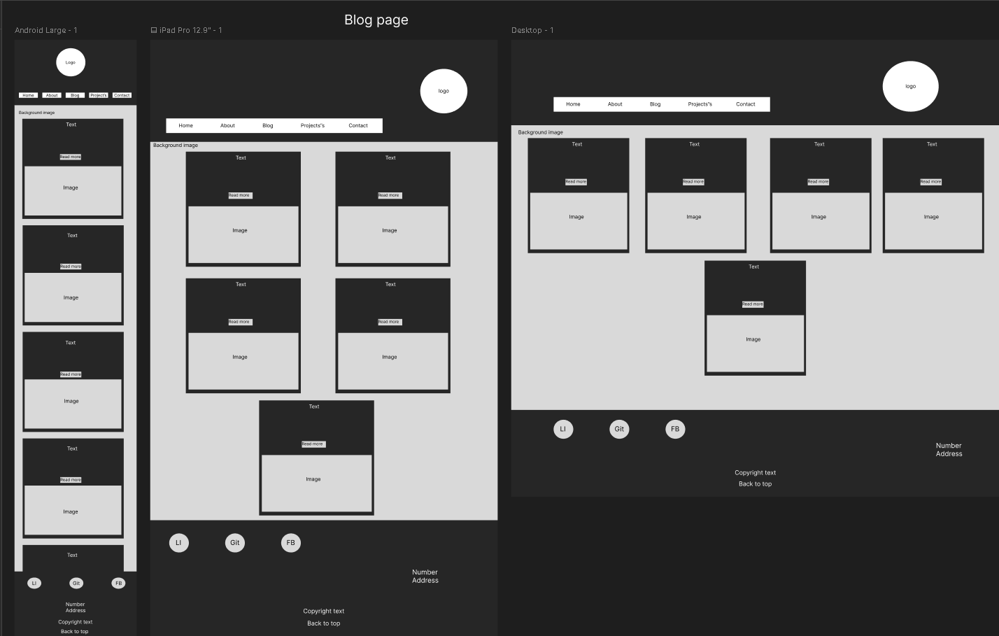
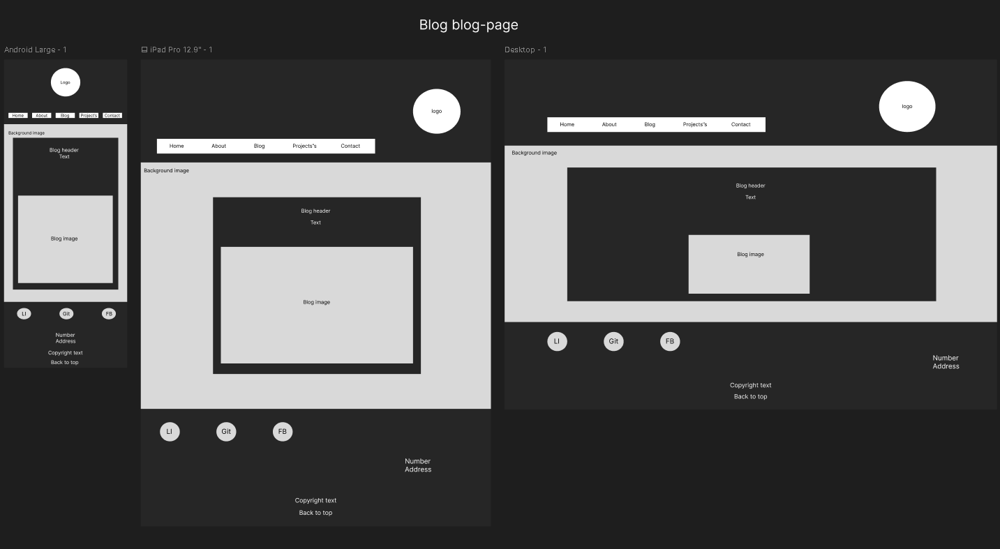

# LukeZHarris-T1A2

__Written and published by *Luke Harris*__

[Link to my published portfolio website](https://lukezharris-t1a2.netlify.app/)  

[Link to my github repository](https://github.com/LukeZHar/LukeZHarris-T1A2)

# Description
## Purpose
The purpose of this website is to showcase my coding abilities at this point in the course by creating a portfolio website.
It will also be used to attract future employers after I have completed the course and have added more to the site with real blogs and projects.  

## Functionality / features
### HTML:5 (HyperText Markup Language)
The whole website is coded using HTML:5 using semantics (very few div).
* The use of < header >, < footer >, and < main > to define the sections of code
    * Inside of the < body >
* The use of < h1 >, < h2 >, < h3 > and < h4 > to create different sizes of heading
* The use of < nav > for my navbar 
* The use of < section > to create my groups of code.
* The use of id="" and class="" thoughout to easily link to my CSS styling code.  
* The use of src="" and href="" to link in websites, images and CSS styling.
    * Used inside < Link >, < img > and < a >.
* The use of < ul > and < li > for making unordered lists.
* The use of < Strong > and < em > to make a bold and italic style.
* The use of < form > for creating my forms.
    * Used < input > and < label > to make my input bubbles and text on the contact page
* The use of < button > for creating my buttons on my about, blog and contact page
* The use of < article > for my blog posts
* The use of < i > for the icons brought over from __fontawesome__
* The use of < p > for writing my paragraphs  

### CSS (Cascading Style Sheets)
The whole website is Styled through the use of CSS. The styling code is linked to the HTML elements.  
1. A base style.css page was created for the Header, footer and all the elements inside. 
2. Then overriding .style pages were created for each indiviual page.  

* The Display used was Flexbox to keep my styling the same across all pages.
* The use of @import for bringing in a font

* The use of @media to change the styling depending on the use of phone, ipad and desktop, started with mobile first.  
  

* The use of @keyframes for making animations

* The use of :root for storing my different colors that i can access through var()
* The use of (*) for storing my box-sizing and font
* (#) linking to my id="" and (.) linking to my class=""
* The use of :hover to change the style when hovering ontop of the element

### Components
#### Header
Is the top part of the page the holds the navbar and logo that users use to navigate through the pages.   

Mobile view  
  

Desktop view  

* #### Navbar
 

* #### Navbar link code

* #### Navbar hover

* #### Navbar hover code

* #### Logo

* #### Logo link code

* #### Logo hover

* #### Logo hover code

#### Body
A small snippit of the background image that will be used across the whole site and some flexbox code  

* #### Background image and flexbox code

#### Footer
Is the bottom part of the page that users can find the social links, address/mobile, copyright info and back to top shortcut

Mobile view  

Destop view  

* #### Icons

* #### Icon link code

* #### Icon hover

* #### Icon hover code

* #### Back to top

* #### Back to top code

#### Home
The main page that visiters will start at, which will have a fade in and typing animation to catch their attention, with a picture of me and a brief paragraph about me and my current studies.  

Home page mobile view  

Home page Desktop view  

* #### Homepage Fade-in Animation
  

* #### Homepage Typing Animation
  

* #### Homepage Animation code

#### About
This page will have a picture of me along side an about me section that will have a brief description, Interests, Skills, Tools, Certificates, Work history and my Resume. I added some icons, because I personaly think it attracts attention to the lists.  

About page mobile view  
  

About page Desktop view  
  

* #### Resume button
 

* #### Resume button hover

* #### Resume button hover code

#### Blog
This page will have 5 blogs with a different heading on each but lorem for the description, a read more button and 1 image.   
  
  
  
  
  

* #### Blog-page
#### Projects
#### Contact
* #### Thank you 
# Screenshots
## Sitemap

My core 5 pages (Home, About, Blog, Project's and contact) will be linked together through a nav bar so it's easy to navigate from one page to the next.

The logo at the top will link back to the *__Home page__*.  

Resume will be accessable through the about page by clicking the *__Resume__* button.  

Blog post will be accessable through the blog page by clicking the *__Read More__* button.  

Thank you page will only be accessable through the contact page by clicking the *__Submit__* button.  

## Wireframes  
My decision making progress for my website aesthetic was a more sleek design I wanted all my pages to have the same theme of header, footer and background.  
I chose a dark and light theme as a personal preference, I enjoy how light and dark come together to make each other stand out.
I did add a spash of color in the text and image choices to really make it __POP__.

#### Homepage
 

#### About page 
 

#### Blog page 
  

* #### Sub Blog post page

#### Project's page  

#### Contact page

* #### Sub Thank you page Animation normal
 
* #### Sub Thank you page Animation Scaled 
  

## Trello 
I found Trello to be incredibly useful in keeping myself in line with completeing work by setting dates and making checklists for inline items that need to be completed for each page 
* #### Trello Board start

* #### Trello Board end

* #### Trello Board Checklist

## Target audience
This content is designed to be viewed by __Coder Academy__ for my T1A2 assessment.  
In the future to be viewed by __Employers__  after I fix it up when completing the course.

## Tech stack (e.g. html, css, deployment platform, etc)
The tech stacks used in this portfolio include:  

Tools: 
* VSCode for writing the HTML code and designing with CSS. 
* Github repository for storing my commited work. 
* Netlify for deploying the final website.  

Code: 
* HTML:5
* CSS

# Refrences
### Websites used
[Link to AIT student portal](https://ait.instructure.com/)

[Link to Canva](https://www.canva.com/)

[Link to CDNjs](https://cdnjs.com/libraries/font-awesome)

[Link to colorkit](https://colorkit.co/contrast-checker/a7bfed-262626/)

[Link to Draw.io](https://app.diagrams.net/)

[Link to ED](https://edstem.org/)

[Link to Favicon](https://favicon.io/favicon-generator/)

[Link to Figma](https://www.figma.com/)

[Link to Fontawesome](https://fontawesome.com/icons)

[Link to Github](https://github.com/) 

[Link to Google fonts](https://fonts.google.com/)

[Link to Netlify](https://app.netlify.com/)

[Link to Trello](https://trello.com)

Background image reference: Photo by Alexandru Acea on Unsplash

Blog image reference: Photo by Pankaj Patel on Unsplash
  